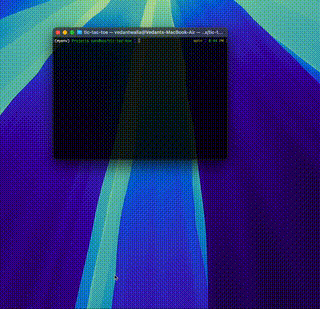

# Tic Tac Toe Game

<p align="center">
  
</p>

## Overview

This is a simple Tic Tac Toe game built using Python and Pygame. The game allows two players to take turns marking spaces on a 3x3 grid. The game detects winning conditions and handles draws, making it a fun way to play the classic game on your computer.

## Features

- Two-player gameplay (Player 1 vs. Player 2)
- Visual representation of the game board with images for X and O
- Win detection for rows, columns, and diagonals
- Reset functionality after a game ends
- Simple and intuitive user interface

## Requirements

- Python 3.x
- Pygame library
- NumPy library

## Installation

1.	Clone the repository:

```bash
git clone https://github.com/yourusername/tic-tac-toe.git
cd tic-tac-toe
```

2.	Install required libraries:
You can install the required libraries using pip:

```bash
pip install pygame numpy
```

3.	Download images:

Make sure to place the o.png and x.png images in a folder named .images in the root of your project directory. You can use any images for O and X as long as they are appropriately named.

How to Run the Game

1.	Navigate to the directory containing the game code.
2.	Run the game using the following command:

```bash
python3 tic_tac_toe.py
```

3.	Follow the on-screen prompts to play the game:
    - Player 1 will use “O” and Player 2 will use “X”.
    - Click on the grid to make your move.

## Gameplay

- Players take turns clicking on the grid to mark their spaces.
- The game will announce the winner when a player has three in a row (horizontally, vertically, or diagonally).
- If the grid is full and no player has won, the game will indicate that it’s a draw.
- After the game ends, the board resets, allowing players to play again.

## Code Structure

- **Game Logic:** Implemented in the main script, which handles player turns, win conditions, and drawing the game board.
- **Graphics:** Utilizes Pygame for rendering the game board and player markers.

## Contributing

If you’d like to contribute to this project, feel free to fork the repository and submit a pull request. Your improvements and suggestions are welcome!

## License

This project is licensed under the MIT License. See the LICENSE file for more details.

## Acknowledgments

	•	Special thanks to the Pygame community for providing the tools and resources to create this game.

Feel free to modify any sections to better fit your project, add screenshots, or provide additional details about the gameplay!